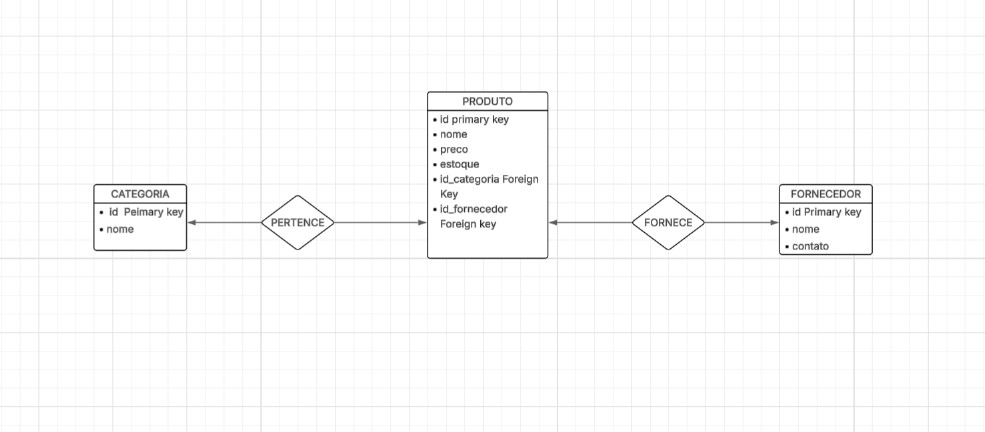

# Controle de Estoque com MySQL

Projeto prático de administração de banco de dados, simulando um sistema de controle de estoque para pequenos comércios. Desenvolvido com foco em **modelagem de dados**, **boas práticas SQL** e **rotinas comuns da atuação como DBA**.

---

## Tecnologias Utilizadas

- MySQL 8.x
- MySQL Workbench
- SQL (DDL, DML, Procedures, Triggers)
- Terminal / CMD
- Git e GitHub

---

## Diagrama DER



---

## O que foi implementado

- Criação de banco e tabelas normalizadas  
- Inserção de dados simulados  
- Consultas SQL com `JOIN`, `GROUP BY` e filtros  
- Procedure para movimentação de estoque  
- Trigger exemplo de log (simples)  
- Criação de usuário com permissões restritas  
- Backup e restore do banco (via Workbench)

---

## Como testar localmente

### Usando MySQL Workbench:
1. Abra o Workbench
2. Execute os scripts em ordem:
   - `create-tables.sql`
   - `insert-dados.sql`
   - `consultas.sql`
   - `procedures_triggers.sql`
3. Teste as procedures no painel de consultas

### Usando o CMD:
```bash
mysql -u root -p < scripts/create-tables.sql
mysql -u root -p < scripts/insert-dados.sql
